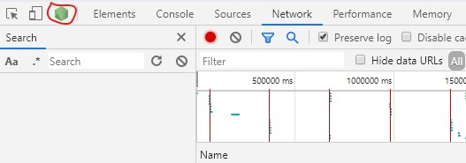
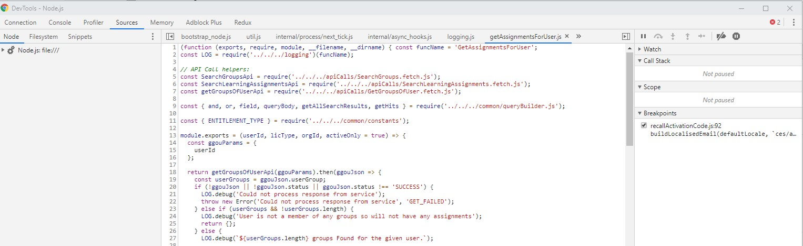
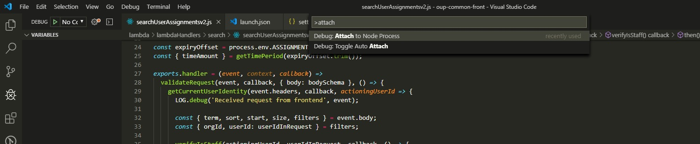
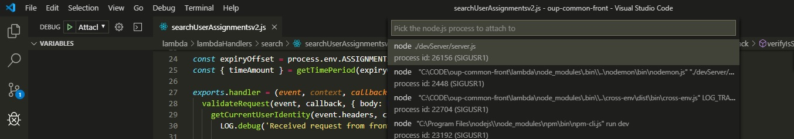
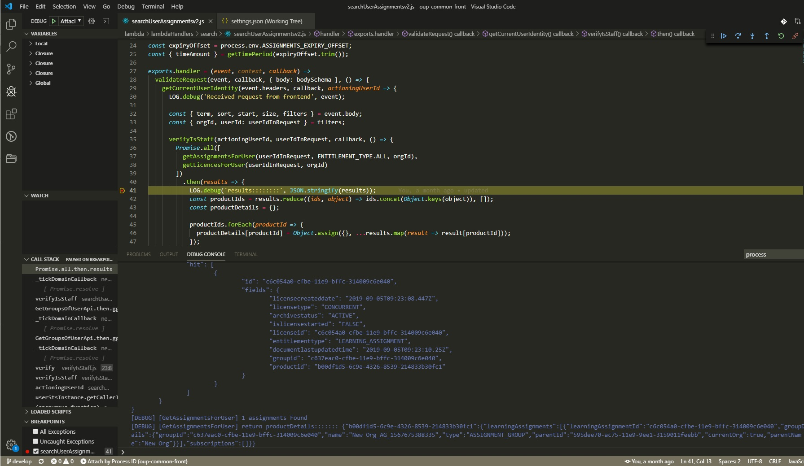

# 1.Debugging Node in Chrome with the inspect flag

## Steps

1. Go to devServer folder in command-line and run the below code

> ``` node --inspect server ```

2. Open chrome console window and click on the top Node icon (screenshot)



3. Opens a new chrome Node console window


# 2.Debug in your IDE (VS Code)

## Steps

1.  Go to terminal in IDE and run the below code

> ``` npm run lambda ```
(starts node server)

2. Click > ```Shift+Ctrl+p```
3. Select Attach to Node Process.

4. Select the top option to attach the debugger.

5. After attaching debugger to Node then you will see the debugger controls.


And you're up and debugging! You can add breakpoints to your code right in your IDE, plus see the scoping of variables and the call stack.
